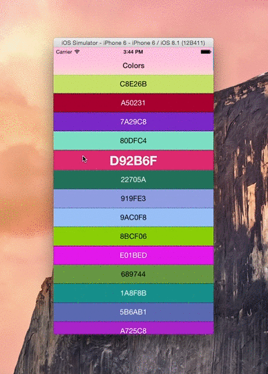

# Colors

Colors is a simple app that demonstrates how to use the View Controller Transitioning API to create a transition effect like the one found in the Apple Weather app.

## Cool, tell me more.

O.K. The app uses a class that acts as a transitioning delegate and intercepts the default push transition animation between one view controller and another inside a `UINavigationController`. It then injects its own custom animation between those two view controllers and iOS does the rest. 

## How does it work?

The custom animation from the table view (`TTColorsViewController`) to the static view (`TTColorViewController`) is done by finding the cell that was selected either by a gesture or by table cell selection, and moving the other cells out of view.

Do the opposite when transitioning back to the table.

All the magic happens in `TTVerticalSplitAnimationController`.

## How do I use it?

- Tap a random color and the transition plays through taking you from one view controller to another.
- Swipe left to right on any color to control the animation with your finger.
- Swipe right to left on the Color screen to transition back to the original place in the table.
- Swipe or don't swipe, its up to you.

## Why can't I use a pinch gesture on the table?

Because I haven't implemented that yet. The swipe was a minimum amount of gesture-based movement needed to achieve the effect.

